# Mechanical Designs

## Drivetrain

Our drivetrain was made from two pairs of differing wheels. The first pair were motor driven wheels that enabled the robot to drive and turn while the second pair were castor wheels that provided stability. These wheel pairs were laid out in the following manner:

(insert picture)

Our motors were chosen after calculating the minimal torque they needed to produce. For our initial calculations, we assumed that our robot would weigh 5 kg, our wheel radius was 5 cm, and that the maximum acceleration our robot would undergo was 1 m/s^2. Using a FBD approach, we then calculated that for our robot to undergo its maximum acceleration, each motor would need to produce a minimum torque of 0.125 Nm. After checking rm. 36’s stock, we found geared DC motors capable of producing up to 2.16 Nm of torque. As these motors met our required minimum torque requirements, we decided to go ahead and use them.

In order to drive and support the motor driven wheels, the following configuration was used:

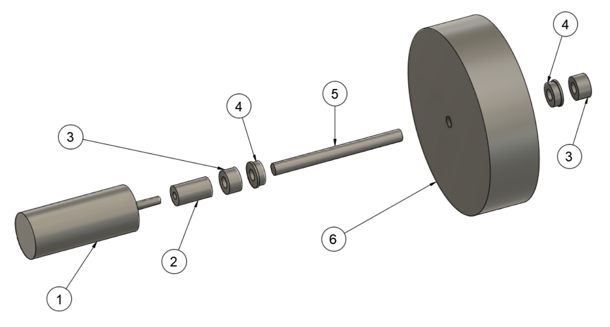

Component List:

1: Motor

2: Shaft Coupler

3: Shaft Collar

4: Ball Bearing

5: D-Shaft

6: Wheel

In this configuration, the wheel was rigidly attached to the D-shaft. Power from the motor was transmitted to the wheel by rigidly connecting the D-shaft to the motor through a shaft coupler. Ball bearings and shaft collars were placed on both sides of the wheel to prevent the weight of the robot that the wheel supported from being transferred over to the motor shaft. This was important since non-axial loading would have damaged the motor. To further mitigate this damage source, flexible shaft couplers could have been used. Unfortunately, rm. 36 did not carry any in their stock any and is why flexible shaft couplers were not used in our design.

Each motor was driven by its own L298 motor driver which was in turn driven by an Arduino through PWM. To maximize our motors’ torque output, two full bridges were run in parallel so each motor could maximize the current it could safely pull. We also powered our motors at their highest voltage rating of 12V.

Overall, our drivetrain ran well and as expected. During the later stages of testing, our team experienced slipping issues as the wheels wore down, however, by wrapping electrical tape around the motor-driven wheels, this issue was resolved.

(insert picture)

# Electrical Design
Our electrical design primarily covers the tape sensing, IR beacon sensing, motor driver, Arduino pinout, and power regulation. The following subsections describes each in further detail.

## Tape Sensing
For tape sensing, we used four ITR20001/T sensors from Adafruit, which have a paired IR LED and phototransistor in a small housing. Each sensor was configured with a transresistive amplifier with outputs connected straight to the Arduino ADC pins. Below is the schematic for each tape sensor:

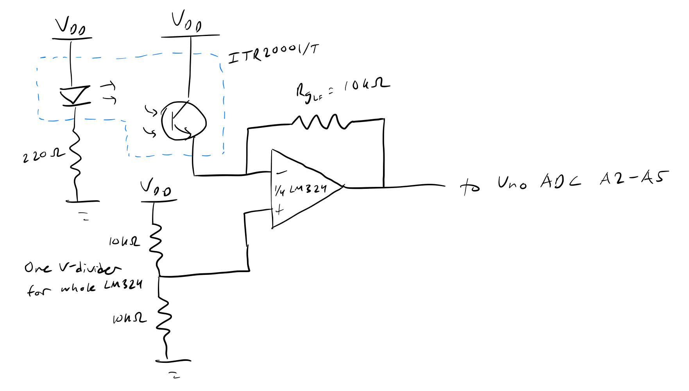

The IR LEDs were always driven on, allowing the Arduino to read a different steady-state analog signal when the tape sensor was above white ground, red tape, and black tape. The transresistive amplifier gain resistor was experimentally chosen to provide sufficient resolution.

## IR Beacon Sensing
To detect the IR beacon next to the Studio, we designed a multi-stage filter and amplifier circuit to output a steady-state analog value representing the strength of the square-wave beacon. 

The Analog Filter Wizard by ADI was used to aid the design of the multi-stage filters.

### High Level Architecture
Below is the high level architecture for the IR beacon sensing. A single phototransistor configured in a transresistive amplifier receives the IR signal, which is passed through a high-pass filter (the prefilter) to remove ambient noise. A switch is used to choose which secondary beacon filter to pass through. The A Filter filters for the 3333Hz beacon, while the B Filter filters for the 909Hz beacon. The siganl is then converted to a steady-state value through the strength detector. Finally, another switch is used to direct the signal to the Arduino ADC pin.

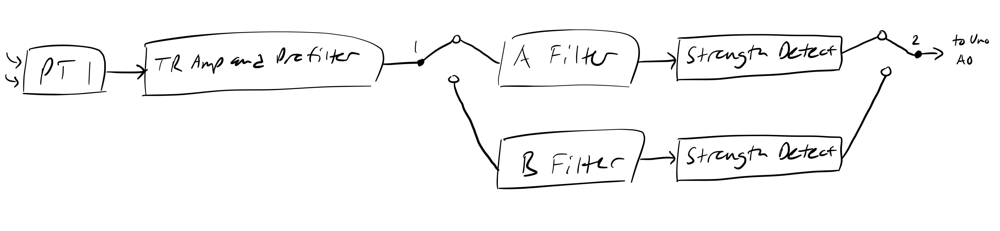

### Transresistive Amplifier and Prefilter (HPF)
The first stage of the circuit includes a transresistive amplifier and a high-pass filter. The gain resistor was experimentally chosen to be able to detect the beacon within the Studio. The high-pass filter was designed with a passband above 500Hz and a stopband below 120Hz. A third-order Chebyshev filter was chosen to minimize the number of stages. A DC offset of 2.5V was added to the output of the high-pass filter.

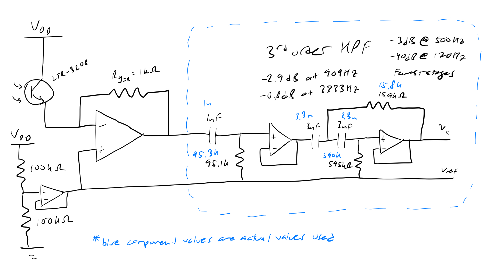

### Beacon A (3333Hz) Filter
A cascaded high-pass and low-pass filter was used to filter for Beacon A. The high-pass filter was designed with a stopband below 1kHz to filter out Beacon B. The low-pass filter was designed to attenuate the odd harmonics, with a stopband above 9kHz to filter out the third harmonic. 

The third harmonic of Beacon B at 2727Hz posed a design challenge, as this was close to the Beacon A frequency of 3333Hz. A high-order filter would be required to severely attenuate the Beacon B third harmonic while passing the Beacon A fundamental. However, as the desired beacon filter can be chosen with the switch, and the beacons cannot be detected outside of the Studio, this did not pose an issue in the end.

A fourth-order Chebyshev high-pass filter and a fourth-order Chebyshev low-pass filter were chosen to minimize the number of stages. The output of the Beacon A filter is a sinusoidal signal at 3333Hz centered around 2.5V.

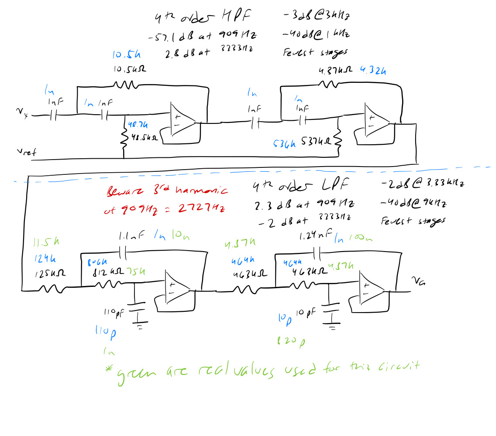

### Beacon B (909Hz) Filter
A low-pass filter was used to filter for Beacon B, as the Prefilter already provides the high-pass filter. A fourth-order Chebyshev filter was chosen for the design. The output of the Beacon B filter is a sinusoidal signal at 909Hz centered around 2.5V.

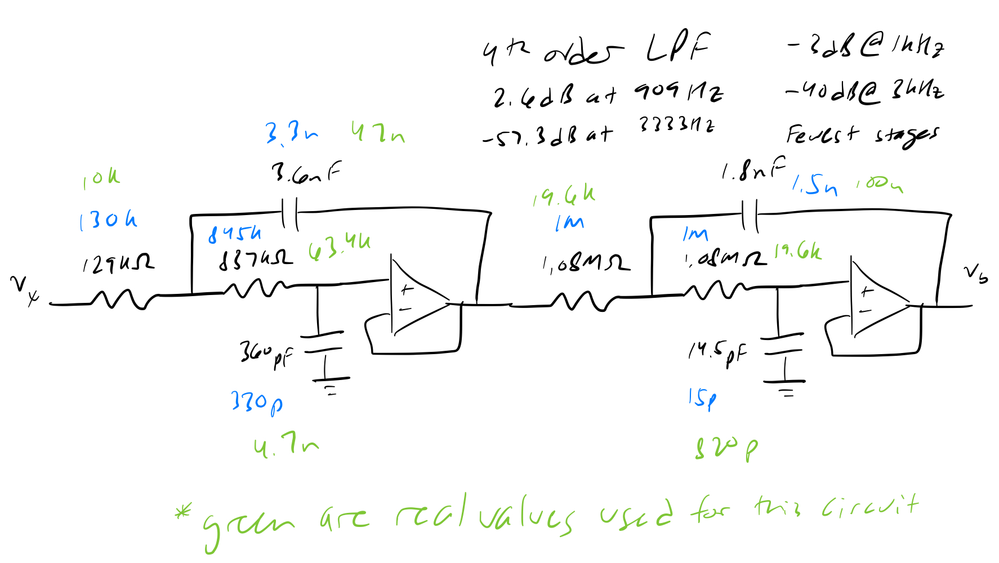

### Strength Detector (Comparator and LPF)
In order to detect the strength of the signal, a comparator was used with a threshold set below 2.5V. As the amplitude of the sinusoidal signal increases, the duration of time that the signal is below the threshold also increases, and the duty cycle of the comparator output increases. Finally, to convert to a steady-state analog value, a second-order Butterworth low-pass filter was chosen.

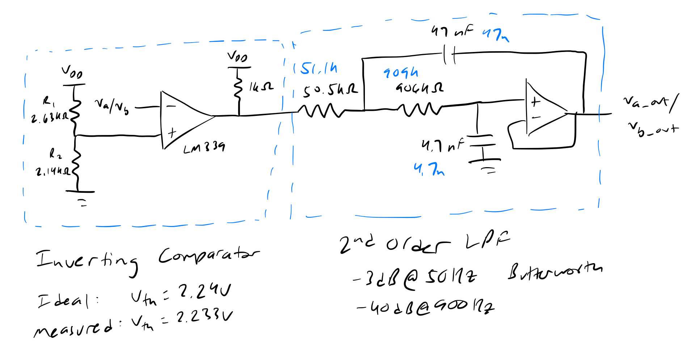

### Completed Protoboard
The circuit was built using SMD components, several LM324 op amps, and a LM339 comparator on a protoboard using copper tape. As shown in the schematics above, the closest real component values were chosen based on availability. The stages were invidually tested before integration with one another, and the entire circuit was tested on the bench with a mock beacon before integration on the bot.

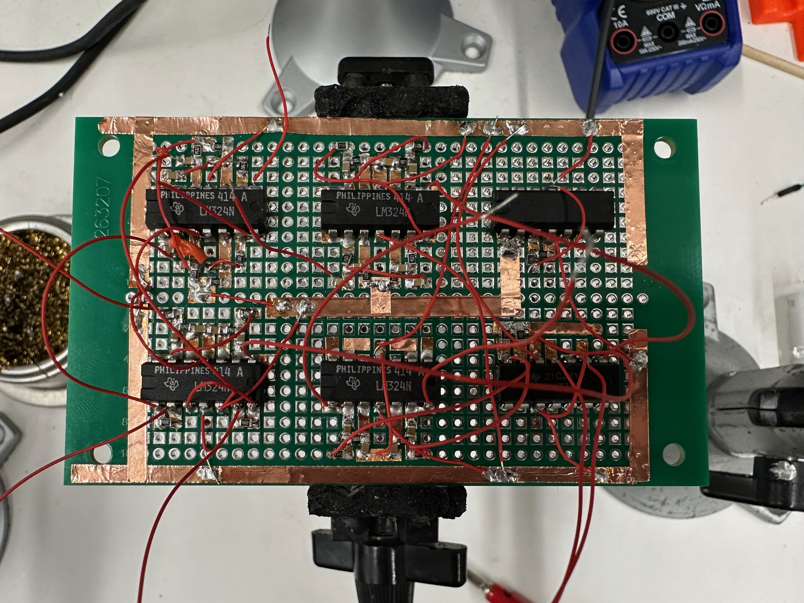

## Motor Driver
In order to drive the motors, we used the L298N breakout board from the stockroom. To maximize the current capability, we used one breakout board for each motor in parallel configuration. A 74HC14 inverter was used to simplify logic and reduce the number of signal wires to two: one for direction, and one for PWM enable.

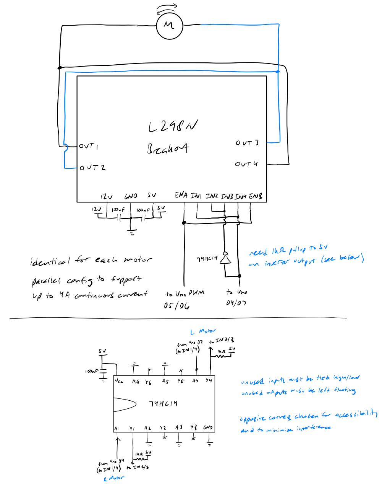

## Arduino Pinout
The pinout for the Arduino in the final version of the bot is shown below. The ADC inputs from the IR beacon and tape sensors are located in the bottom left. The motor driver outputs and servo outputs are located on the right side, with pinouts chosen to ensure PWM capability. 

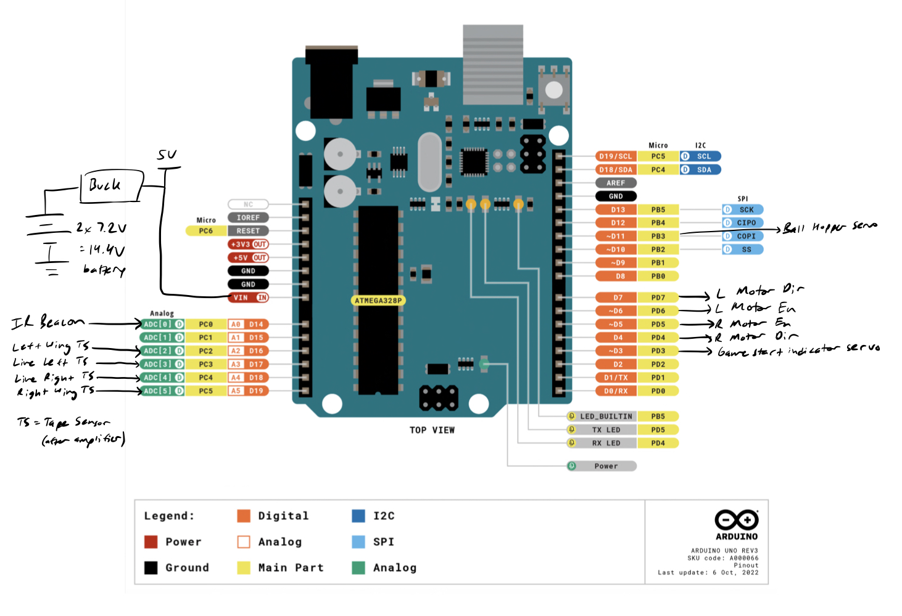

## Power Regulation
To power the robot, we wired the two 7.2V NiMH batteries in series for a nominal 14.4V supply. We then used a 20A adjustable buck converter from Amazon to step down to 12V for the motor power supply. For logic power, we used another 3A adjustable buck converter from Amazon to step down from 12V to 5V.  

# State Diagrams

The overall strategy of our robot was to turn towards the IR beacon, stopping when we saw a certain amplitude of the filtered signal, then follow the line towards the bad press, followed by following the line to the good press and depositing two balls at each of those.

Our dispensing mechanism was a tube of four press, with one servo at the bottom which prevented the press from falling out. We could drop two press only by opening and closing the servo at a specific time. Originally, our finite state machines assumed that we would have two servos to form a kind of airlock system, having only one press to drop at a time.

We had also wanted to use an IMU for more consistent turning, but removed it to avoid additional points of failure on our robot. Instead, we turned for approximate amounts of time and depended on sensing the tape.

The following FSMs are our preliminary ones, the final code was streamlined and relied more on timers rather than only sensor inputs.

## Exiting Studio
For our final code, we did the following:
- Start in the studio
- Turn until the ir beacon reached a threshold
- Drive forward for some time (hoping to exit the box surrounded by black tape)
- Follow the red tape

Original FSM included turning 360 degrees to read the highest IR value, then turn towards it, and then detect the black tape to determine when we had left the studio
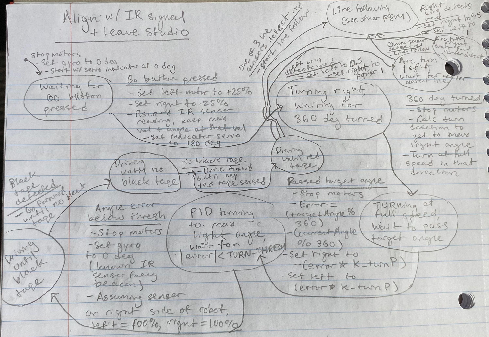

The following image is our initial FSM for leaving the studio.

## Dispensing Press

For our final code, we opened the bottom servo (only one required) for a set number of milliseconds, then closed the servo.

The following image is our initial FSM for dispesning one press
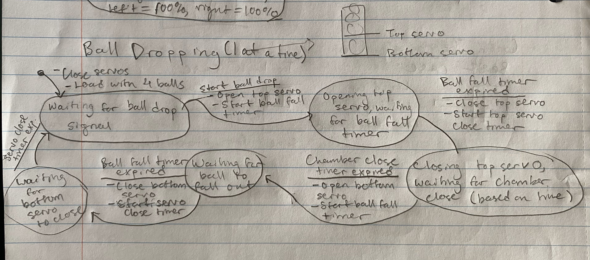

## Line Follow
Our final code used a simplified approach to line follow:
- If the difference between left and right line sensors are between a threshold, go forward with half power
- Otherwise, if the left reading was more than the right reading (left sensor was over the red tape, right was not), set left motor to 0, right motor to half power to turn left
- Otherwise, turn right by setting left motor to half power, right motor to 0

Here is our original FSM, which employed P-only closed loop control (using difference between the left/right and center sensors as the error)
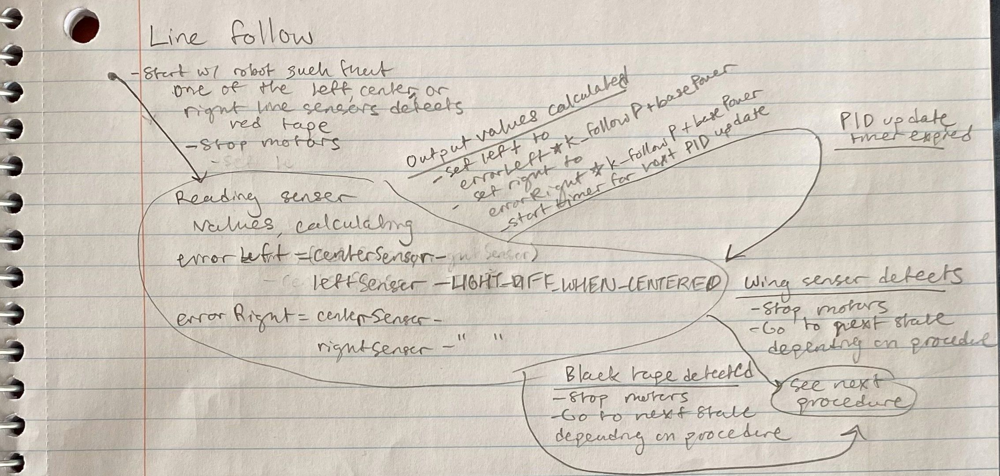

## Full FSM for Checkoff
Again, this image is the FSM that references the above state machines, to ultimately complete the goal of dispensing two press in the good press, and then two in the bad press

For our final code, we ended up traveling to the bad press first to throw off opponents who needed the press scales to be level for scoring. We also used timers to replace the gyro, and a simpler line follow method, as described in the line follow section.

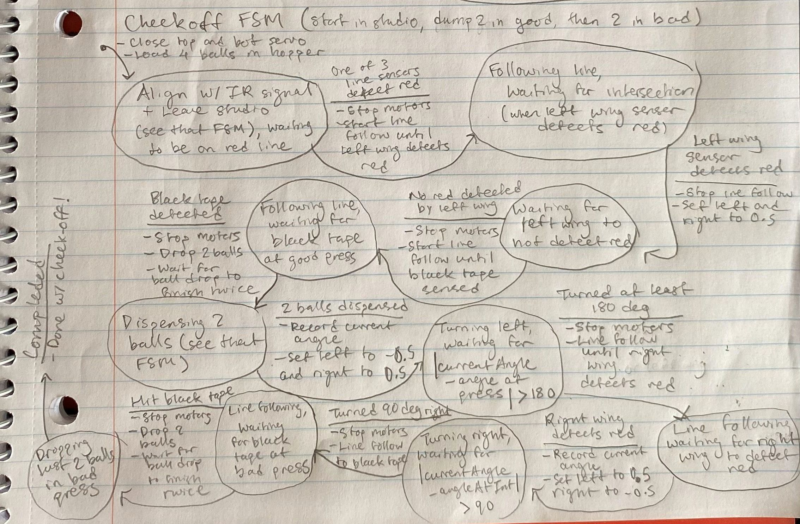

# Code
Under lib/, we have libraries for each of the main subsystems on our robot. These are abstractions so the `main.cpp` file can easily call methods like `getLineFollowPowers()` and `setLeftPower()` rather than worrying about manual calls to `analogWrite()` or `analogRead()`

All of the FSM logic is in `main.cpp`

## File Structure
```
me210-final-project/
├── lib/
│   ├── Drive/
│   │   ├── Drive.cpp
│   │   └── Drive.h
│   ├── Hopper/
│   │   ├── Hopper.cpp
│   │   └── Hopper.h
│   └── LineFollow/
│       ├── LineDataTypes.h
│       ├── LineFollow.cpp
│       └── LineFollow.h
└── src/
    └── main.cpp
```

## Main.cpp
```cpp
#include <Arduino.h>
#include <Drive.h>
#include <Hopper.h>
#include <LineDataTypes.h>
#include <LineFollow.h>
#include <SPI.h>

// Setup the hardware timer constants, needs to be before #include
// TimerInterrupt
#define USE_TIMER_1 false
#define USE_TIMER_2 true

#define PRINT_FREQ 1.0  // Hz

#include "TimerInterrupt.h"

// Motor constants
#define LEFT_MOTOR_DIR_PORT 7
#define LEFT_MOTOR_EN_PORT 6  // 10 stopped working
#define RIGHT_MOTOR_EN_PORT 5
#define RIGHT_MOTOR_DIR_PORT 4

#define IS_LEFT_INVERTED 1   // was 0
#define IS_RIGHT_INVERTED 0  // was 1

#define FULL_SPEED 127
#define HALF_SPEED 64  // 64 // Max forward is 127 // originalLy 64 changed by ESL
#define QUARTER_SPEED 48

#define IS_TESTING_DRIVE 0  // Set to 1 to test the driving

#define GYRO_PORT 0x28

// PID Constants
#define MAX_TURN_ERROR 1.0  // Degrees
#define K_P_TURN 1 / 180.0  // Full motor output at the max error (need to do a
// full turn)

// Tape sensing
#define LEFT_WING_PORT A2
#define LINE_LEFT_PORT A3
#define LINE_RIGHT_PORT A4
#define RIGHT_WING_PORT A5

// Measured 3/2/23 at 11:18pm
// ~4-5 mm between the bottom of the shielding and the bottom of the tape
// sensor, ~3/4 in from bottom of shielding to the floor Using a Vce of 2.5V
// with transresistive amplifier, 10k gain resistor, 5V input to LED

#define MAX_WHITE_VOLTAGE \
  190  // This and below, white surface 3-7-23 after some tape mounting
#define MIN_BLACK_VOLTAGE \
  300  // This and above, black surface 3-7-23 after some tape mounting

#define CENTER_TO_SIDE_DIFFERENCE \
  MIN_BLACK_VOLTAGE -             \
      MAX_WHITE_VOLTAGE  // Difference between center sensor and left/right tape
                         // sensors when fully centered
// #define TURN_K_P 1/180.0 // Full motor output at the max error (need to do a
// full turn)

// Servo constants
#define HOPPER_BOT_SERVO 11
#define INDICATOR_SERVO 3
#define SERVO_MAX_ANGLE 180
#define SERVO_MIN_ANGLE 0

#define IR_BEACON_MIN \
  350  // TODO: Test, min value where you know you are facing close enough to
       // the IR beacon wasa 250, then 300 for checkoff

#define LINE_FOLLOW_UPDATE_FREQ 50 // ms

typedef enum {
  DRIVE_FORWARD,
  TURN_RIGHT,
  TURN_LEFT,
  STOP,
  DRIVE_BACKWARD,
  NOTHING,
  EXITING_STUDIO,
  DRIVING_STUDIO_TO_GOOD,
  DRIVING_STUDIO_TO_BAD,
  DRIVING_FROM_GOOD_TO_BAD,
  DRIVING_FROM_BAD_TO_GOOD,
  DRIVING_GOOD_TO_STUDIO,
  DISPENSE_TWO_BALLS,
  DISPENSE_ALL_BALLS,
} States_t;

typedef enum {
  TURNING_TO_IR_BEACON,
  DRIVING_OUT_OF_STUDIO,
  LINE_FOLLOW_UNTIL_LEFT_WING,
  DRIVE_UNTIL_NO_LEFT_WING,
  LINE_FOLLOW_UNTIL_BLACK_TAPE,
  TURNING_180_DEG,
  LINE_FOLLOW_UNTIL_RIGHT_WING,
  TURNING_90_DEG_RIGHT,
  TURNING_90_DEG_LEFT_TO_BAD,
  WAIT_FOR_LINE_FOLLOW_INPUT,
  TURNING_90_DEG_LEFT_TO_GOOD,
  BACKUP,
  DRIVING_PAST_LINE,
  ENTER_STUDIO,
  PERPENDICULAR_PARK,
  PERPENDICULAR_EXIT

  // The following states are to get back onto the red line after leaving the
  // studio
} Line_follow_states_t;

#define ENTER_STUDIO_TIME 1100 // was 750 ESL
#define BALL_LOAD_TIME 3000
#define SKIP_RED_LINE_TIME 150

typedef enum { GOOD_PRESS, BAD_PRESS } Score_targets_t;


static Line_thresholds_t thresholds = {
    // LW values
    132, 370, 280, // 3-8-23 at 12am, then 295, then 350
    // LL values
    133, 350, 285, // 3-8-23 at 9pm // Was 205, too low when untetheres, was 255, then 285, then 300, was 350 JAV
    // LR values
    131, 350, 290, // 3-8-23 at 8pm // Was 205, too low when unteth, was 245, then 275, then 300, was 350 JAV
    // RW Values
    128, 360, 280, // Untested, just guess for competition Was 200, then 250, then 295, then 325
};

#define LEAVE_STUDIO_TIME 100 // it was 325 for checkoff // was 200 ESL
#define EXIT_TURN_DELAY \
  0  // Keep the robot straight after aligning with IR beacon
#define LINE_FOLLOW_WAIT \
  1000  // Follow line for 2 seconds before checking for wings

#define LINE_FOLLOW_BAD_GOOD_WAIT 2000
#define TURN_TIME_90_DEG_ONE_HALF_SPD 1400 // TODO: Tune/measure was 563
#define TURN_TIME_180_BOTH_MOTORS 900
#define TURN_TIME_GOOD_PRESS 1500 // Was 600 JAV, then 800 too low
#define K_P_LINE_FOLLOW 0.5 // Max diff ~100 units, base power is 0.5, make max error = full power
#define LINE_FOLLOW_BASE_POWER HALF_SPEED * 0.89 // 1.1 working, 1.3 too fast, so is 1.25 when at 20 (even 10) sensor slop, 1.15 ok, 1.0 now with grippy

#define BACKUP_TIME 200
#define WAIT_TO_DETECT_BLACK 10000 // 5 too short, 15 seconds too long
#define BACKUP_TIME_GOOD_TO_STUDIO 400

static States_t state = NOTHING;
static Line_follow_states_t line_follow_state = WAIT_FOR_LINE_FOLLOW_INPUT;
static bool isDriving;
static Drive drivebase;
static double turnTarget = 0.0;
static LineFollow lineFollow =
    LineFollow(LEFT_WING_PORT, LINE_LEFT_PORT, LINE_RIGHT_PORT, RIGHT_WING_PORT,
               thresholds);

// Tunable parameters
static double k_p_turn = K_P_TURN;
static double turn_max_error = MAX_TURN_ERROR;
static uint16_t max_white = MAX_WHITE_VOLTAGE;
static uint16_t min_black = MIN_BLACK_VOLTAGE;
static uint16_t center_to_side_diff = CENTER_TO_SIDE_DIFFERENCE;

#define IR_SENSE_1 A0

#define NUM_SERVOS 2
#define INDICATOR_STEPS 3
#define MOVE_INDICATOR_TIME 1000  // 5 Seconds

static Servo servo;  // Used for all servos
static Hopper hopper;
uint8_t hasIndicated = 0;  // Will be 2 when it's finished

uint32_t last_time = 0;

Score_targets_t scoring_target;

void driveTest();
void handleExitStudio(Score_targets_t press_target);
void followLine();
void outputSensorVals();
void outputStateChanges();
void printUpdateAndChange(uint16_t &old, uint16_t new_val);
void printUpdateAndChange(double &old, double new_val);
void handleConstantChange();
void handleStudioToGood();
void handleStudioToBad();
void moveIndicator();
void handleBadToGood();
void handleGoodToStudio(); // TODO: Finish getting back to studio

void setup() {
  Serial.begin(9600);
  while (!Serial)
    ;

  Serial.println("Code started");

  // // Init drivebase
  drivebase = Drive(LEFT_MOTOR_DIR_PORT, LEFT_MOTOR_EN_PORT,
                    RIGHT_MOTOR_DIR_PORT, RIGHT_MOTOR_EN_PORT, GYRO_PORT);

  drivebase.setLeftInverted(IS_LEFT_INVERTED);
  drivebase.setRightInverted(IS_RIGHT_INVERTED);
  isDriving = false;

  pinMode(IR_SENSE_1, INPUT);
  Serial.println("Drivebase initialized");

  // Init more values
  hasIndicated = 0;  // Will be 2 when it's finished
  last_time = 0;
  scoring_target = GOOD_PRESS;

  // Indicate
  if (!servo.attach(INDICATOR_SERVO)) {
    Serial.println("Indicator unable to attach to its pin");
  }  // The port for the ball dropper
  // 3 is the indicator servo
  servo.write(SERVO_MAX_ANGLE);
  ITimer2.init();
  ITimer2.setInterval(MOVE_INDICATOR_TIME / INDICATOR_STEPS, moveIndicator,
                      MOVE_INDICATOR_TIME);

  lineFollow.setThresholds(thresholds);
  state = EXITING_STUDIO;
  // state = DRIVING_GOOD_TO_STUDIO; // for testing return to studio ESL
  line_follow_state = TURNING_TO_IR_BEACON; // for testing return to studio ESL
  // line_follow_state = LINE_FOLLOW_UNTIL_BLACK_TAPE; // For line follow testing only
  drivebase.setLeftPower(-QUARTER_SPEED); 
  drivebase.setRightPower(QUARTER_SPEED);
  // drivebase.setLeftPower(QUARTER_SPEED); // for testing ESL
  // drivebase.setRightPower(QUARTER_SPEED);
}

void loop() {
  // Re-attach the servo to the hopper
  if (hasIndicated >= INDICATOR_STEPS && !hopper.isInitialized()) {
    hopper = Hopper(servo, HOPPER_BOT_SERVO);
  }

  // End to end drive test
  // if (IS_TESTING_DRIVE && !isDriving) {
  //   isDriving = true;
  //   driveTest();
  // }

  // Test forwards, backwards, left right
  // For drive testing (no gyro)
  
  if (Serial.available()) {
    uint8_t aKey = Serial.read();
    while (Serial.available()) {
      Serial.read();
    }
    Serial.println(aKey);
    switch (aKey) {
      // Update values on the fly, only works with the first one
      // case 116:  // t for turn error
      //   Serial.println("Input a new value for turn error");
      //   while (!Serial.available())
      //     ;
      //   double new_error = Serial.parseFloat();
      //   printUpdateAndChange(turn_max_error, new_error);
      //   break;
      // case 112:  // p for turn p
      //   Serial.println("Input a new value for turn p: ");
      //   while (!Serial.available())
      //     ;
      //   double new_p = Serial.parseFloat();
      //   printUpdateAndChange(k_p_turn, new_p);
      //   break;
      // case 119:  // w for white tape thresh
      //   Serial.println("Input a new value for max white: ");
      //   while (!Serial.available())
      //     ;
      //   uint16_t new_white_thresh = Serial.parseInt();
      //   printUpdateAndChange(max_white, new_white_thresh);
      //   break;
      case 98:  // b for backwards
        state = DRIVE_BACKWARD;
        drivebase.setLeftPower(-FULL_SPEED);
        drivebase.setRightPower(-FULL_SPEED);
        // Serial.println("Input a new value for min black: ");
        // while (!Serial.available())
        //   ;
        // uint16_t new_black_thresh = Serial.parseInt();
        // printUpdateAndChange(min_black, new_black_thresh);
        break;
      case 99:  // c for calibrate
        state = NOTHING;
        drivebase.setLeftPower(HALF_SPEED);
        drivebase.setRightPower(HALF_SPEED);

      // case 100:  // d for diff
      //   Serial.println("Input a new value for center to side difference: ");
      //   while (!Serial.available())
      //     ;
      //   uint16_t new_center_side_diff = Serial.parseInt();
      //   printUpdateAndChange(center_to_side_diff, new_center_side_diff);
      //   break;
      // Tests for drivebase
      case 108:  // l
        state = TURN_LEFT;
        drivebase.setLeftPower(-FULL_SPEED);
        drivebase.setRightPower(FULL_SPEED);
        break;
      case 102:  // f
        state = DRIVE_FORWARD;
        Serial.println("forward plz?");
        drivebase.setLeftPower(FULL_SPEED);
        drivebase.setRightPower(FULL_SPEED);
        break;
      case 115:  // s
        state = STOP;
        drivebase.stopMotors();
        break;
      case 114:  // r
        state = TURN_RIGHT;
        drivebase.setLeftPower(FULL_SPEED);
        drivebase.setRightPower(-FULL_SPEED);
        break;
      case 103:                                         // g
        drivebase.setGyroOffset(drivebase.getAngle());  // Zero the gyro
        break;
      // Tests for line follow
      case 101:  // e
        state = EXITING_STUDIO;
        line_follow_state = TURNING_TO_IR_BEACON;
        // line_follow_state = LINE_FOLLOW_UNTIL_BLACK_TAPE; // For line follow testing only
        drivebase.setLeftPower(-QUARTER_SPEED);
        drivebase.setRightPower(QUARTER_SPEED);


        // // Testing only 180
        // state = DRIVING_FROM_BAD_TO_GOOD;
        // line_follow_state = TURNING_180_DEG;
        // drivebase.setLeftPower(-HALF_SPEED);
        // drivebase.setRightPower(HALF_SPEED);
        // last_time = millis();
        break;
      case 100:  // d for drop
        hopper.dropTwoBalls();
        break;
      default:
        break;
    }
  }

  // if (state == EXITING_STUDIO) {
  //   switch (line_follow_state) {
  //     case LINE_FOLLOW_UNTIL_BLACK_TAPE:
  //       followLine();
  //       break;
  //   }
  // }

  switch (state) {
    case EXITING_STUDIO:
      handleExitStudio(scoring_target);  // TODO: Test Good presss
      break;
    case DISPENSE_TWO_BALLS:
      hopper.dropTwoBalls();
      if (scoring_target == BAD_PRESS) {
        state = DRIVING_FROM_BAD_TO_GOOD;
      } else {
        state = DRIVING_GOOD_TO_STUDIO;
      }
      line_follow_state = BACKUP;
      Serial.println("Bck up");
      last_time = millis();
      drivebase.setLeftPower(-HALF_SPEED);
      drivebase.setRightPower(-HALF_SPEED);
      break;
    case DISPENSE_ALL_BALLS:
      hopper.dropAllBalls();
      state = DRIVING_GOOD_TO_STUDIO;
      line_follow_state = BACKUP;
      Serial.println("Bck up");
      last_time = millis();
      drivebase.setLeftPower(-HALF_SPEED);
      drivebase.setRightPower(-HALF_SPEED);
    case DRIVING_STUDIO_TO_BAD:
      handleStudioToBad();
      break;
    case DRIVING_STUDIO_TO_GOOD:
      handleStudioToGood();
      break;
    case DRIVING_FROM_BAD_TO_GOOD:
      handleBadToGood();
      break;

    // TODO: Below states for competition
    case DRIVING_GOOD_TO_STUDIO: // Not needed for checkoff
      handleGoodToStudio();
      break;
    // case WAITING_FOR_GO:
    //   // TODO: Something
    //   break;
    default:
      break;  // Don't really care about the other states here
  }

  // Periodic print without using Timer2 (which messes with deploying the code)
  if (millis() % 1000L == 0) {
    // Serial.println("Outputting");
    outputSensorVals();
  }
  // outputStateChanges();
}

void moveIndicator() {
  // Serial.println("Indicating");
  if (hasIndicated >= INDICATOR_STEPS) {
    // Do nothing
  } else {
    // Serial.println("Movings");
    if (hasIndicated % 2 == 0) {
      servo.write(SERVO_MAX_ANGLE);
    } else {
      servo.write(SERVO_MIN_ANGLE);
    }
    hasIndicated++;
  }
}

void outputStateChanges() {
  if (lineFollow.testForBlackTape()) {
    Serial.println("Found black tape!");
  }
  if (lineFollow.testForLeftWingRed()) {
    Serial.println("Left wing sensing red");
  }
}

void outputSensorVals() {
  // drivebase.printDebug();
  lineFollow.printDebug();
  Serial.print("IR sensor ");
  Serial.println(analogRead(IR_SENSE_1));
  // Serial.println(state);
  // Serial.println(line_follow_state);
}

// Output the change between and old and new value, and overwrite the old value
// to be the new one
void printUpdateAndChange(double &old, double new_val) {
  Serial.print("Old value: ");
  Serial.print(old);
  Serial.print("New value: ");
  Serial.println(new_val);
  old = new_val;
}

void printUpdateAndChange(uint16_t &old, uint16_t new_val) {
  Serial.print("Old value: ");
  Serial.print(old);
  Serial.print("New value: ");
  Serial.println(new_val);
  old = new_val;
}

void handleGoodToStudio() {
  switch (line_follow_state) {
    case BACKUP:
      if ((millis() - last_time) > (BACKUP_TIME_GOOD_TO_STUDIO)) {
        drivebase.setLeftPower(-QUARTER_SPEED * 0.75);
        drivebase.setRightPower(QUARTER_SPEED * 0.75 * 1.03); // changed ESL BRIAN
        last_time = millis();
        line_follow_state = TURNING_90_DEG_LEFT_TO_GOOD;
      }
      break;
    case TURNING_90_DEG_LEFT_TO_GOOD:
      // Follow line after waiting for a ~180 deg turn
      if ((millis() - last_time > (TURN_TIME_GOOD_PRESS)) && lineFollow.testForOnLine()) {
        Serial.println("Fllw lw hit");
        last_time = millis();
        // line_follow_state = LINE_FOLLOW_UNTIL_RIGHT_WING;
        line_follow_state = LINE_FOLLOW_UNTIL_BLACK_TAPE;
        followLine();
      }
      break;
    case LINE_FOLLOW_UNTIL_BLACK_TAPE:
      if (((millis() - last_time) > WAIT_TO_DETECT_BLACK) && (lineFollow.testForLeftWingBlack() || lineFollow.testForRightWingBlack())) {
        line_follow_state = PERPENDICULAR_PARK; // ESL and below commented
        drivebase.stopMotors();
        // last_time = millis(); 
        // line_follow_state = ENTER_STUDIO;
        // drivebase.setLeftPower(QUARTER_SPEED*0.95);
        // drivebase.setRightPower(QUARTER_SPEED);
      } else {
        followLine();
      }
      break;
    case PERPENDICULAR_PARK: // ESL whole case
      if (lineFollow.testForLeftWingBlack() && lineFollow.testForRightWingBlack()) {
        last_time = millis();
        line_follow_state = ENTER_STUDIO;
        drivebase.setLeftPower(QUARTER_SPEED*0.97);
        drivebase.setRightPower(QUARTER_SPEED);
      } else if (lineFollow.testForLeftWingBlack()) {
        drivebase.setLeftPower(0);
        drivebase.setRightPower(QUARTER_SPEED);
      } else if (lineFollow.testForRightWingBlack()) {
        drivebase.setLeftPower(QUARTER_SPEED);
        drivebase.setRightPower(0);
      } else {
        drivebase.setLeftPower(QUARTER_SPEED*0.97);
        drivebase.setRightPower(QUARTER_SPEED);
      }
      break;
    case ENTER_STUDIO:
      if ((millis() - last_time) > ENTER_STUDIO_TIME) {
        drivebase.stopMotors();
        last_time = millis();
        line_follow_state = WAIT_FOR_LINE_FOLLOW_INPUT;
      }
      break;
    case WAIT_FOR_LINE_FOLLOW_INPUT:
      if ((millis() - last_time) > BALL_LOAD_TIME) {
        state = EXITING_STUDIO;
        line_follow_state = TURNING_TO_IR_BEACON;
        drivebase.setLeftPower(-QUARTER_SPEED);
        drivebase.setRightPower(QUARTER_SPEED);
      }
      break;
  }
}

void handleBadToGood() {
  switch (line_follow_state) {
    case BACKUP:
      if (millis() - last_time > BACKUP_TIME) {
        drivebase.setLeftPower(-HALF_SPEED);
        drivebase.setRightPower(HALF_SPEED);
        last_time = millis();
        line_follow_state = TURNING_180_DEG;
      }
      break;
    case TURNING_180_DEG:
      // Follow line after waiting for a ~180 deg turn
      if ((millis() - last_time > (TURN_TIME_180_BOTH_MOTORS)) && lineFollow.testForOnLine()) {
        Serial.println("Line following until left wing hits");
        last_time = millis();
        line_follow_state = LINE_FOLLOW_UNTIL_LEFT_WING;
        followLine();
      }
      break;
    case LINE_FOLLOW_UNTIL_LEFT_WING:
      if ((millis() - last_time > LINE_FOLLOW_BAD_GOOD_WAIT) && lineFollow.testForLeftWingRed()) {
        Serial.println("Turning 90 deg left to good");
        last_time = millis();
        line_follow_state = TURNING_90_DEG_LEFT_TO_GOOD;
        drivebase.setLeftPower(0);
        drivebase.setRightPower(HALF_SPEED);
      } else {
        followLine();
      }
      break;
    case TURNING_90_DEG_LEFT_TO_GOOD:
      if ((millis() - last_time > TURN_TIME_90_DEG_ONE_HALF_SPD) && lineFollow.testForOnLine()) {
        line_follow_state = LINE_FOLLOW_UNTIL_BLACK_TAPE;
        Serial.println("Line follow until bad tape at good press");
        followLine();
      } 
      break;
    case LINE_FOLLOW_UNTIL_BLACK_TAPE:
      if (lineFollow.testForBlackTape()) {
        Serial.println("Got black tape");
        drivebase.stopMotors();
        line_follow_state = WAIT_FOR_LINE_FOLLOW_INPUT;
        state = DISPENSE_ALL_BALLS;
        scoring_target = GOOD_PRESS; // Only score on good press after first attempt
      } else {
        followLine();
      }
      break;
  }
}

/**
 * Exit studio procedure (separate FSM)
 * Will get to the first intersection from starting aligned in the studio
 */
void handleExitStudio(Score_targets_t press_target) {
  switch (line_follow_state) {
    case TURNING_TO_IR_BEACON:
      if (analogRead(IR_SENSE_1) > IR_BEACON_MIN) {
        delay(EXIT_TURN_DELAY);
        drivebase.setLeftPower(HALF_SPEED);
        drivebase.setRightPower(HALF_SPEED); // CHANGED BY ESL *0.95
        line_follow_state = DRIVING_OUT_OF_STUDIO;
        // line_follow_state = PERPENDICULAR_EXIT;
        last_time = millis();
        Serial.println("Exiting studio by driving forward");
      }
      break;
    case PERPENDICULAR_EXIT:
      if (lineFollow.testForLeftWingBlack() && lineFollow.testForRightWingBlack()) {
        last_time = millis();
        line_follow_state = DRIVING_OUT_OF_STUDIO;
        drivebase.setLeftPower(QUARTER_SPEED*0.97);
        drivebase.setRightPower(QUARTER_SPEED);
      } else if (lineFollow.testForLeftWingBlack()) {
        drivebase.setLeftPower(0);
        drivebase.setRightPower(QUARTER_SPEED);
      } else if (lineFollow.testForRightWingBlack()) {
        drivebase.setLeftPower(QUARTER_SPEED);
        drivebase.setRightPower(0);
      }
      break;
    case DRIVING_OUT_OF_STUDIO:
      // TODO: if timer expired, stop
      // Drive for one second
      if (millis() - last_time > LEAVE_STUDIO_TIME) {
        drivebase.stopMotors();
        line_follow_state = LINE_FOLLOW_UNTIL_LEFT_WING;
        last_time = millis();
        Serial.println("Driving until left wing");
      }
      break;
    case LINE_FOLLOW_UNTIL_LEFT_WING:
      // Line follow for a bit before checking the wing too early
      if (millis() - last_time > LINE_FOLLOW_WAIT &&
          lineFollow.testForLeftWingRed()) {
        // Determine what state to handle depending on the scoring target
        if (press_target == GOOD_PRESS) {
          line_follow_state = LINE_FOLLOW_UNTIL_BLACK_TAPE; // Just ignore the tape, keep going
          state = DRIVING_STUDIO_TO_GOOD;
          drivebase.setLeftPower(FULL_SPEED);
          drivebase.setRightPower(FULL_SPEED);
        } else if (press_target == BAD_PRESS) {
          state = DRIVING_STUDIO_TO_BAD;
          line_follow_state = TURNING_90_DEG_LEFT_TO_BAD;
          last_time = millis();
          Serial.println("Beginning turn left to hit the bad press line");
          // turnTarget = drivebase.getAngle() - 90;
          drivebase.setLeftPower(0);
          drivebase.setRightPower(HALF_SPEED);
        }
      } else {
        followLine();
      }
      break;

    // case LINE_FOLLOW_UNTIL_BLACK_TAPE: // For testing line follow only, set state to LINE_FOLLOW_UNTIL_BLACK_TAPE in main
    //   followLine();
    //   break;
    default:
      Serial.println("Something is not good in exiting studio");
      break;
  }
}

void followLine() {
  // if (millis() % LINE_FOLLOW_UPDATE_FREQ == 0) {
    // Make it simple, then implement PID
    Motor_powers_t powers = lineFollow.getLineFollowPowers(K_P_LINE_FOLLOW, LINE_FOLLOW_BASE_POWER);
    drivebase.setLeftPower(powers.left_power);
    drivebase.setRightPower(powers.right_power);
  // }
}

// After getting to the intersection of the tape driving from studio to good
// press, get to good press
void handleStudioToGood() {
  switch (line_follow_state) {
    // case DRIVE_UNTIL_NO_LEFT_WING:
    //   if (!lineFollow.testForLeftWingRed()) {
    //     line_follow_state = LINE_FOLLOW_UNTIL_BLACK_TAPE;
    //     followLine();
    //   }
    //   break;
    case LINE_FOLLOW_UNTIL_BLACK_TAPE:
      if (lineFollow.testForBlackTape()) {
        drivebase.stopMotors();
        line_follow_state = WAIT_FOR_LINE_FOLLOW_INPUT;
        state = DISPENSE_ALL_BALLS;
        last_time = millis();
      } else {
        followLine();
      }
      break;
    default:
      break;
  }
}

// After getting to the intersection of the tape driving from studio to bad
// press, get to bad press
void handleStudioToBad() {
  switch (line_follow_state) {
    case TURNING_90_DEG_LEFT_TO_BAD:
      // Turned enough to start checking if on line
      if ((millis() - last_time > TURN_TIME_90_DEG_ONE_HALF_SPD) && lineFollow.testForOnLine()) {
        line_follow_state = LINE_FOLLOW_UNTIL_BLACK_TAPE;
        Serial.println("Folw til blk at bad");
        followLine();
      }
      break;
    
      // double turn_error = drivebase.calcTurnError(turnTarget);
      // // If turned 90 degrees, follow the line
      // if (abs(turn_error) <= turn_max_error) {
      //   if (!lineFollow.testForOnLine(max_white, min_black)) {
      //     Serial.println("Turned 90 deg, not on the line, hoping for the
      //     best");
      //   }
      //   line_follow_state = LINE_FOLLOW_UNTIL_BLACK_TAPE;
      //   followLine();
      //   // Otherwise, keep turning 90 degrees
      // } else {
      //   drivebase.setTurnPIDPowers(turnTarget, k_p_turn);
      // }

      // if (!lineFollow.testForOnLine()) {
      //   Serial.println("Turning 90 deg, not on the line, hoping for the best");
      // } else {
      //   line_follow_state = LINE_FOLLOW_UNTIL_BLACK_TAPE;
      //   followLine();
      // }
    case LINE_FOLLOW_UNTIL_BLACK_TAPE:
      if (lineFollow.testForBlackTape()) {
        Serial.println("Drp bad");
        drivebase.stopMotors();
        state = DISPENSE_TWO_BALLS;
        line_follow_state = WAIT_FOR_LINE_FOLLOW_INPUT;
      } else {
        followLine();
      }
  }
}

// Note: Very bad style, uses delay which stops program execution
void driveTest() {
  // Drive straight at half speed, then stop
  Serial.println("Going forward");
  drivebase.setLeftPower(HALF_SPEED);
  drivebase.setRightPower(HALF_SPEED);
  delay(2000);  // 2 Seconds
  drivebase.stopMotors();
  Serial.println("Stopped motors");
  delay(500);

  // Turn to (roughly) 90 degrees
  Serial.println("Turning right 90 deg");
  drivebase.setLeftPower(HALF_SPEED);
  drivebase.setRightPower(-HALF_SPEED);
  uint8_t count = 0;
  uint8_t target = 90;
  double error = 0.0;
  do {
    error = drivebase.calcTurnError(target);
    if (count == 0) {  // Print every 255 cycles
      Serial.println(drivebase.getAngle());
    }
    count++;
  } while (abs(error) >= turn_max_error * 10);
  drivebase.stopMotors();
  delay(500);

  // Turn (roughly) to 45 degrees
  Serial.println("Turning left 45 deg");
  target = 45;
  drivebase.setLeftPower(-HALF_SPEED);
  drivebase.setRightPower(HALF_SPEED);

  // Keep turning until you got there
  do {
    error = drivebase.calcTurnError(target);
    if (count == 0) {  // Print every 255 cycles
      Serial.println(drivebase.getAngle());
    }
    count++;
  } while (abs(error) >= turn_max_error * 10);
  drivebase.stopMotors();
  delay(500);

  Serial.println("Full power forward");
  // Drive straight at full power
  drivebase.setLeftPower(FULL_SPEED);
  drivebase.setRightPower(FULL_SPEED);
  delay(1000);
}
```

## Drive
### Drive.h
```cpp
/**
 * Drive.h contains the exposed methods for the drive subsystem
 * Get/set gyro position
 * Set left/right motor
 */

#ifndef Drive_h
#define Drive_h
#include <Adafruit_I2CDevice.h>
#include <Adafruit_BNO055.h>
#include <inttypes.h>

class Drive {
 public:
  Drive(); // Allows for drive to be initialized in setup
  Drive(uint8_t left_dir_port, uint8_t left_en_port, uint8_t right_dir_port,
        uint8_t right_en_port, uint8_t gyro_prt);
  void setLeftInverted(uint8_t inverted);
  void setRightInverted(uint8_t inverted);
  void setLeftPower(int8_t power);
  void setRightPower(int8_t power);
  void stopMotors();
  double getAngle();
  void setGyroOffset(double offset);
  double calcTurnError(double target_angle);
  void setTurnPIDPowers(double target_angle, double k_p); 
  void printDebug();

 private:
  bool isLeftInverted();
  bool isRightInverted();
  bool leftDir();
  bool rightDir();
  void setRightDir(uint8_t dir);
  void setLeftDir(uint8_t dir);
  void setGyroInit();
  bool getGyroInit();
  uint8_t l_dir_port;
  uint8_t l_en_port;
  uint8_t r_dir_port;
  uint8_t r_en_port;
  uint8_t gyro_port;

  /* Structure of invertsAndState:
    0, 0, 0, gyroInitialized, LeftInverted, RightInverted, LeftDir, RightDir
      */
  uint8_t inverts_and_states;  // Each bit is different info
  Adafruit_BNO055 gyro;
  double gyro_offset;
};

#endif
```
### Drive.cpp
```cpp
/**
 * Drive.cpp is the implementation for the drive subsystem
 */
#include "Drive.h"

#define USE_EXT_CRYSTAL true

/* Structure of invertsAndState:
    0, 0, 0, GyroInit, LeftInverted, RightInverted, LeftDir, RightDir
*/
#define GYRO_INIT_MASK (uint8_t)0b10000
#define LEFT_INVERT_MASK (uint8_t)0b1000
#define RIGHT_INVERT_MASK (uint8_t)0b0100
#define LEFT_DIR_MASK (uint8_t)0b0010
#define RIGHT_DIR_MASK (uint8_t)0b0001

// DO NOT CHANGE THESE, bitmasks depend on forward = 0, backward = 1
#define FORWARD (uint8_t)0
#define BACKWARD (uint8_t)1

#define LEFT_SCALAR 1.0 // was 0.95 ESL
#define RIGHT_SCALAR 0.97 // was 0.1 ESL

#define GYRO_DEGREES 360.0  // Max value from gyro (0 - 359.9999)
#define GYRO_HALF_DEGREES (GYRO_DEGREES / 2)

Drive::Drive() {
  // Ports default to garbage values
  inverts_and_states = 0;
}

Drive::Drive(uint8_t left_dir_port, uint8_t left_en_port,
             uint8_t right_dir_port, uint8_t right_en_port, uint8_t gyro_prt) {
  // State initialization
  inverts_and_states = 0;

  // Gyro initialization
  gyro_offset = 0;
  gyro_port = gyro_prt;

  // // Init gyro to pass to drivebase
  // if (!gyro.begin()) {
  //   Serial.println("No gyro detected");
  // }
  // gyro.setExtCrystalUse(true);
  // setGyroInit();

  // Motor initialization
  l_dir_port = left_dir_port;
  l_en_port = left_en_port;
  r_dir_port = right_dir_port;
  r_en_port = right_en_port;

  pinMode(l_dir_port, OUTPUT);
  pinMode(l_en_port, OUTPUT);
  pinMode(r_dir_port, OUTPUT);
  pinMode(r_en_port, OUTPUT);
  digitalWrite(l_dir_port, LOW);
  digitalWrite(r_dir_port, LOW);
  analogWrite(l_en_port, LOW);
  analogWrite(r_en_port, LOW);

  setLeftDir(FORWARD);
  setRightDir(FORWARD);
  stopMotors();
}

// Set direction of the motors
void Drive::setRightDir(uint8_t dir) {
  if (dir == BACKWARD) {
    inverts_and_states |= RIGHT_DIR_MASK;  // Turn on
    digitalWrite(r_dir_port, HIGH);
  } else {
    inverts_and_states &= ~RIGHT_DIR_MASK;  // Turn off
    digitalWrite(r_dir_port, LOW);
  }
}

// Set direction of the motors
void Drive::setLeftDir(uint8_t dir) {
  if (dir == BACKWARD) {
    inverts_and_states |= LEFT_DIR_MASK;  // Turn on
    digitalWrite(l_dir_port, HIGH);
  } else {
    inverts_and_states &= ~LEFT_DIR_MASK;  // Turn off
    digitalWrite(l_dir_port, LOW);
  }
}

bool Drive::isLeftInverted() { return inverts_and_states & LEFT_INVERT_MASK; }

bool Drive::isRightInverted() { return inverts_and_states & RIGHT_INVERT_MASK; }

bool Drive::leftDir() { return inverts_and_states & LEFT_DIR_MASK; }

bool Drive::rightDir() { return inverts_and_states & RIGHT_DIR_MASK; }

void Drive::setGyroInit() { inverts_and_states |= GYRO_INIT_MASK; }

bool Drive::getGyroInit() { return inverts_and_states & GYRO_INIT_MASK; }

void Drive::setLeftInverted(uint8_t inverted) {
  if (inverted == BACKWARD) {
    inverts_and_states |= LEFT_INVERT_MASK;  // Turn on invert
  } else {
    inverts_and_states &= ~LEFT_INVERT_MASK;  // Turn off invert
  }
}

void Drive::setRightInverted(uint8_t inverted) {
  if (inverted == BACKWARD) {
    inverts_and_states |= RIGHT_INVERT_MASK;  // Turn on invert
  } else {
    inverts_and_states &= ~RIGHT_INVERT_MASK;  // Turn off invert
  }
}

// Set left power between -128 and 127
void Drive::setLeftPower(int8_t power) {
  // Make motor go forward with positive power, or backward if it's negative
  // power
  if (power >= 0) {
    if (isLeftInverted()) {
      setLeftDir(BACKWARD);
    } else {
      setLeftDir(FORWARD);
    }
  }
  // Power is negative, change direction of the motor
  else {
    if (isLeftInverted()) {
      setLeftDir(FORWARD);
    } else {
      setLeftDir(BACKWARD);
    }
  }

  // Set PWM power, converting the negative/positive range into a 0-255 output
  // Input is between -127 to 128, which shows direction and magnitude
  // Want the power to be between 0 to 255, so multiply abs(input) by 2
  analogWrite(l_en_port, uint8_t(((abs(power)) << 1) * LEFT_SCALAR));
}

// Set right power between -128 and 127
void Drive::setRightPower(int8_t power) {
  // Make motor go forward with positive power, or backward if it's negative
  // power
  if (power >= 0) {
    if (isRightInverted()) {
      setRightDir(BACKWARD);
    } else {
      setRightDir(FORWARD);
    }
  }
  // Power is negative, change direction of the motor
  else {
    if (isRightInverted()) {
      setRightDir(FORWARD);
    } else {
      setRightDir(BACKWARD);
    }
  }

  // Set PWM power, converting the negative/positive range into a 0-255 output
  // Input is between -127 to 128, which shows direction and magnitude
  // Want the power to be between 0 to 255, so multiply abs(input) by 2
  analogWrite(r_en_port, uint8_t(((abs(power)) << 1) * RIGHT_SCALAR));
}

void Drive::stopMotors() {
  setRightPower(0);
  setLeftPower(0);
}

double Drive::getAngle() {
  if (getGyroInit()) {
    double yaw =
        gyro.getVector(Adafruit_BNO055::VECTOR_EULER).x() - gyro_offset;

    // Get a range from [0, 360.0) with offset (if offset is 50, want 0 (-50) to
    // now map to 310.0)
    if (yaw < 0) {
      return yaw + GYRO_DEGREES;
    } else {
      return yaw;
    }
  }
  return -1;  // Error, gyro not initialized
}

void Drive::setGyroOffset(double offset) {
  gyro_offset = offset;  // Can be used so 0 is always when the robot IR sensor
                         // is facing the beacon
}

/**
 * Get the turn error (to use for PID turning), limited from -180 to 180.
 * @param target_angle should be between 0 and 359 (absolute target), but can be between [-360.0, inf)
*/
double Drive::calcTurnError(double target_angle) {
  // Normalize the target angle
  if (target_angle > GYRO_DEGREES) {
    target_angle = fmod(target_angle, GYRO_DEGREES);
  // fmod doesn't work the way I want it to with negatives (remainder still negative), so this is a way of fixing angles between -360.0 and 0
  } else if (target_angle < 0) {
    target_angle += GYRO_DEGREES;
  }

  double error = target_angle - getAngle();
  if (error > GYRO_HALF_DEGREES) {
    error -= GYRO_DEGREES;
  }
  return error;
}

void Drive::setTurnPIDPowers(double target_angle, double k_p) {
  double error = calcTurnError(target_angle);
  double product = error * k_p;
  // Cap powers to max inputs
  if (abs(product) > INT8_MAX) {
    product = copysign(INT8_MAX, product);
  }
  setLeftPower(product);
  setRightPower(-product);
}

void Drive::printDebug() {
  Serial.print("Gyro angle: ");
  Serial.println(getAngle());
}

```

## Hopper
### Hopper.h
```cpp
/**
 * Wrapper for the hopper subsystem, allows user to drop x number of balls
*/

#ifndef Hopper_h
#define Hopper_h
#include <Servo.h>
#include <inttypes.h>
class Hopper {
  public:
    Hopper(); // Only to initialize at first
    Hopper(Servo &servo, uint8_t servo_port);
    /**
     * NOTE: These functions use delay to get the correct timing (not the best practice)
    */
    void dropTwoBalls();
    void dropAllBalls();
    bool isInitialized();
  private:
    Servo _servo;
    bool _is_attached;
};

#endif

```
### Hopper.cpp
```cpp
/**
 * Hopper subsystem wrapper
 */

#include <Arduino.h>
#include <Hopper.h>

#define DEFAULT_ANGLE 180
#define DROP_ANGLE 135
#define DROP_ONE_TIME 175 // Was 125 before servo change
#define DROP_ALL_TIME 700

Hopper::Hopper() { _is_attached = false; }

Hopper::Hopper(Servo &servo, uint8_t servo_port) {
  _servo = servo;
  _servo.attach(servo_port);
  _servo.write(DEFAULT_ANGLE);
  _is_attached = true;
}

void Hopper::dropTwoBalls() {
  if (_is_attached) {
    _servo.write(DROP_ANGLE);
    delay(DROP_ONE_TIME);
    _servo.write(DEFAULT_ANGLE);
  } else {
    Serial.println("Servo not attached!");
  }
}

void Hopper::dropAllBalls() {
  if (_is_attached) {
    _servo.write(DROP_ANGLE);
    delay(DROP_ALL_TIME);
    _servo.write(DEFAULT_ANGLE);
  } else {
    Serial.println("Servo not attached!");
  }
}

bool Hopper::isInitialized() {
    return _is_attached;
}
```
## Line Follow
### LineFollow.h
```cpp
/**
 * LineFollow.h defines all of the exposed methods for the line following subsystem, including using its five tape sensors
*/

#ifndef LineFollow_h
#define LineFollow_h
#include <inttypes.h>
#include <LineDataTypes.h>

class LineFollow {
  public:
    /**
     * Pass in the ports for the tape sensors on the robot
    */
    LineFollow(uint8_t left_wing, uint8_t line_left, uint8_t line_right,
                       uint8_t right_wing, Line_thresholds_t thresholds); 
    bool testForBlackTape();
    bool testForLeftWingBlack(); // added ESL
    bool testForRightWingBlack(); // added ESL
    /**
     * Check if the left wing sees red tape (given max value for white, and min value for black tape)
    */
    bool testForLeftWingRed();
    /**
     * Check if the left wing sees either red or black tape
    */
    bool testForRightWingRed();
    /**
     * Get the error for PID line follow, given the difference between the center and right/left wings when the robot is centered over the line
    */
    Motor_powers_t getLineFollowPowers(double k_p, int8_t base_power); // TODO: Add P for smoother line follow
    /**
     * Check that any of the line sensors (middle 3) are on the line
    */
    bool testForOnLine();
    void printDebug();
    void setThresholds(Line_thresholds_t thresholds);
    Line_sensor_vals_t LineFollow::getSensorReadings();

  private:
    uint8_t _left_wing;
    uint8_t _line_left;
    uint8_t _line_right;
    uint8_t _right_wing;
    Line_thresholds_t _thresholds;
    bool isRed(uint16_t sensor_value, uint16_t min_white,
                       uint16_t max_red, uint16_t max_black);
    bool isBlack(uint16_t sensor_value, uint16_t max_red);

};
#endif
```

### LineFollow.cpp
```cpp
/**
 * LineFollow.cpp is the class for using 5 tape sensors to follow a line and
 * detect intersections
 */

#include "LineFollow.h"

#include <Arduino.h>

#define RED_BLACK_WIGGLE_ROOM 125 // Was 150, then 125 (now that red tape is 370) // was 100 before comp ESL
#define SENSOR_NOISE 3 // Was 20, then 10 

LineFollow::LineFollow(uint8_t left_wing, uint8_t line_left, uint8_t line_right,
                       uint8_t right_wing, Line_thresholds_t thresholds) {
  _left_wing = left_wing;
  _line_left = line_left;
  _line_right = line_right;
  _right_wing = right_wing;
  _thresholds = thresholds;
}

void LineFollow::setThresholds(Line_thresholds_t thresholds) {
  _thresholds = thresholds;
}

Line_sensor_vals_t LineFollow::getSensorReadings() {
  return {analogRead(_left_wing), analogRead(_right_wing),
          analogRead(_line_left), analogRead(_line_right)};
}

bool LineFollow::testForBlackTape() {
  // Check if any of the sensors detect black tape
  bool lw_black = isBlack(analogRead(_left_wing), _thresholds.max_lw_red);
  // bool ll_black = isBlack(analogRead(_line_left), _thresholds.max_ll_red);
  // bool lr_black = isBlack(analogRead(_line_right), _thresholds.max_lr_red);
  bool rw_black = isBlack(analogRead(_right_wing), _thresholds.max_rw_red);

  // TODO: Only for testing
  // if (lw_black) {
  //   Serial.println("Left wing black");
  // }
  // if (ll_black) {
  //   Serial.println("Line left black");
  // }
  // if (lr_black) {
  //   Serial.println("Line right black");
  // }
  // if (rw_black) {
  //   Serial.println("Right wing black");
  // }


  return rw_black;
}

bool LineFollow::testForLeftWingBlack() { // ESL
  return isBlack(analogRead(_left_wing), _thresholds.max_lw_red);
}

bool LineFollow::testForRightWingBlack() { // ESL
  return isBlack(analogRead(_right_wing), _thresholds.max_rw_red);
}

bool LineFollow::testForLeftWingRed() {
  return isRed(analogRead(_left_wing), _thresholds.min_lw_white,
               _thresholds.max_lw_red, _thresholds.max_lw_black);
}

bool LineFollow::testForRightWingRed() {
  return isRed(analogRead(_right_wing), _thresholds.min_rw_white,
               _thresholds.max_rw_red, _thresholds.max_rw_black);
}

bool LineFollow::testForOnLine() {
  bool is_left_red = isRed(analogRead(_line_left), _thresholds.min_ll_white,
                           _thresholds.max_ll_red, _thresholds.max_ll_black);
  bool is_right_red = isRed(analogRead(_line_right), _thresholds.min_lr_white,
                            _thresholds.max_lr_red, _thresholds.max_lr_black);
  return is_left_red || is_right_red;
}

Motor_powers_t LineFollow::getLineFollowPowers(double k_p, int8_t base_power) {
  uint16_t left_value = analogRead(_line_left);
  uint16_t right_value = analogRead(_line_right) + 1;

  int16_t error = left_value - right_value;
  // double pid_output = error * k_p;
  if (abs(error) < SENSOR_NOISE) {
    return {(base_power >> 2) * 3, (base_power >> 2) * 3}; // Fast 7/8 power for straight line (>> 3 for /8, * 7 for 7/8)
  } else if (right_value > (left_value + SENSOR_NOISE)) {
    // Turn right
    return {base_power, 0};
  } else {
    // Turn left
    // If left value more than right value, it is more red, therefore, turn left
    return {0, base_power};
  }
  
}

bool LineFollow::isRed(uint16_t sensor_value, uint16_t min_white,
                       uint16_t max_red, uint16_t max_black) {
  uint16_t max_white = (min_white + max_red) >> 1;  // Divide by 2 for average
  uint16_t min_black = (max_red + RED_BLACK_WIGGLE_ROOM);
  return (sensor_value > max_white) && (sensor_value < min_black);
}

bool LineFollow::isBlack(uint16_t sensor_value, uint16_t max_red) {
  return sensor_value > (max_red + RED_BLACK_WIGGLE_ROOM);
}

void LineFollow::printDebug() {
  Serial.print("LW: ");
  Serial.println(analogRead(_left_wing));
  Serial.print("LineL: ");
  Serial.println(analogRead(_line_left));
  Serial.print("LineR: ");
  Serial.println(analogRead(_line_right));
  Serial.print("RW: ");
  Serial.println(analogRead(_right_wing));
}
```
### LineDataTypes.h
```cpp
#ifndef LineDataTypes_h
#define LineDataTypes_h
#include <inttypes.h>

typedef struct {
  int8_t left_power;
  int8_t right_power;
} Motor_powers_t;

typedef struct {
  uint16_t min_lw_white;
  uint16_t max_lw_red;
  uint16_t max_lw_black;

  uint16_t min_ll_white;
  uint16_t max_ll_red;
  uint16_t max_ll_black;

  uint16_t min_lr_white;
  uint16_t max_lr_red;
  uint16_t max_lr_black;

  uint16_t min_rw_white;
  uint16_t max_rw_red;
  uint16_t max_rw_black;
} Line_thresholds_t;

typedef struct {
  uint16_t lw;
  uint16_t ll;
  uint16_t lr;
  uint16_t rw;
} Line_sensor_vals_t;

#endif
```

# Bill of Materials
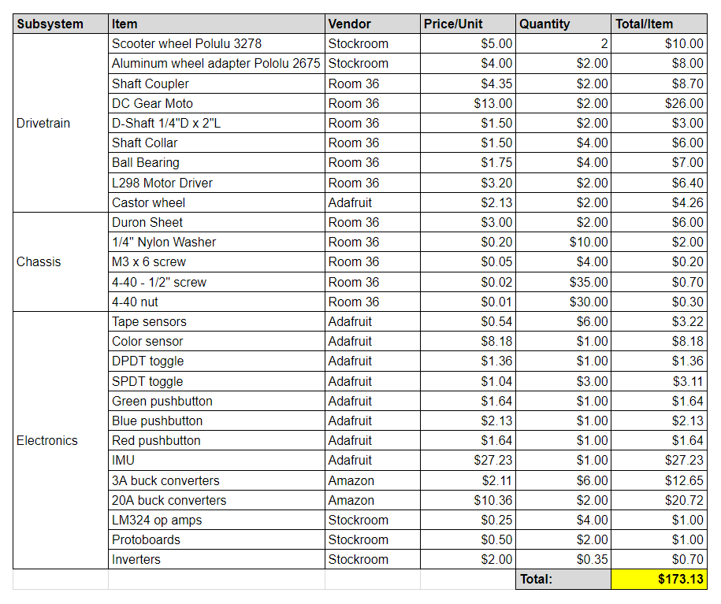